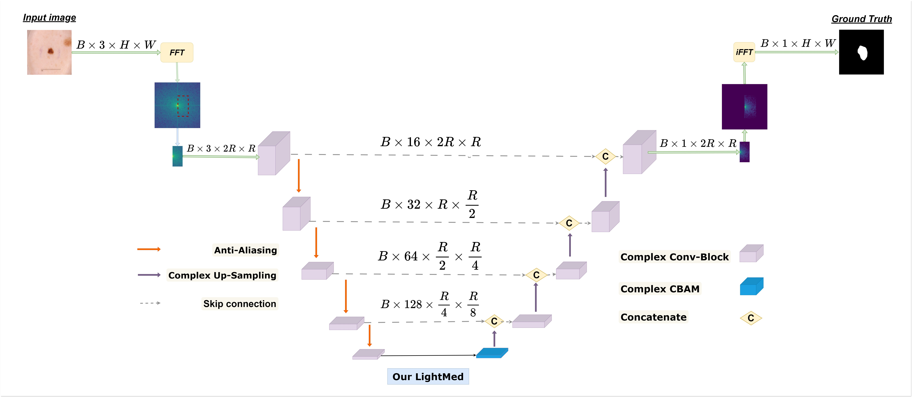

  <table>
    <tr>
      <td></td>
      <td><h1>LightMed:  A PyTorch Implementation</h1></td>
    </tr>
  </table>

      
  

  
Yes, I am LightMed!

🎉 This is a PyTorch/GPU implementation of the paper **LightMed (LM)**, which learning on frequecy domain.

**LightMed**

 📝[[Paper](https://www.biorxiv.org/content/10.1101/2024.09.28.615584v1.full.pdf)] </>[[code](https://github.com/HySonLab/LightMed)]

# LightMed: A Lightweight and Robust FFT-Based Model for Adversarially Resilient Medical Image Segmentation
An efficient FFT-based model for medical image segmentation. The algorithm is elaborated on our paper [LightMed: A Lightweight and Robust FFT-Based Model for Adversarially Resilient Medical Image Segmentation](https://arxiv.org/abs/)

## Requirement

``pip install -r requirement.txt``

## Example Cases
### Melanoma Segmentation from Skin Images (2018)
1. Download ISIC_2018 datast we processing from https://www.kaggle.com/datasets/haminhhieu/isic-2018-data. You must download and your dataset folder under "data" should be like:

~~~
ISIC_2018
---- image_train.npy  
---- mask_train.npy 
----dataset
|   ----test_0
|   |   |images_test.npy
|   |   |masks_test.npy
|   ----test_1
|   |   |images_test.npy
|   |   |masks_test.npy
|   ----test_2
|   |   |images_test.npy
|   |   |masks_test.npy
|   ----test_3
|   |   |images_test.npy
|   |   |masks_test.npy       
|   ----test_4
|   |   |images_test.npy
|   |   |masks_test.npy 
 
~~~
    
2. For training, example run: ``python train.py --num_epochs 300 --batch_size 16 -- image_size 256 -- work_dir *folder save weight*``

3. For evaluation noise, example run: `` python test.py --model_paths *folder you save checkpoint* --test_dataset_paths *folder test_ dataset* --image_size 256``

4. For evaluation attack, example run: ``python test_fgsm_attack.py --model_path *folder you save checkpoint* --test_dataset_path *folder test dataset* --attack``

### Other Examples
...
### Run on  your own dataset
Welcome to open issues if you meet any problem. It would be appreciated if you could contribute your dataset extensions. Unlike natural images, medical images vary a lot depending on different tasks. Expanding the generalization of a method requires everyone's efforts.

## Thanks
Code copied a lot from [soleilssss/ FFCNet](https://github.com/soleilssss/FFCNet), [soleilssss/ AFACNet](https://github.com/soleilssss/AFACNet), [JCruan519/EGE-UNet](https://github.com/JCruan519/EGE-UNet), and [adam-dziedzic/bandlimited-cnns](https://github.com/adam-dziedzic/bandlimited-cnns)
## Cite
Please cite
~~~
~~~

